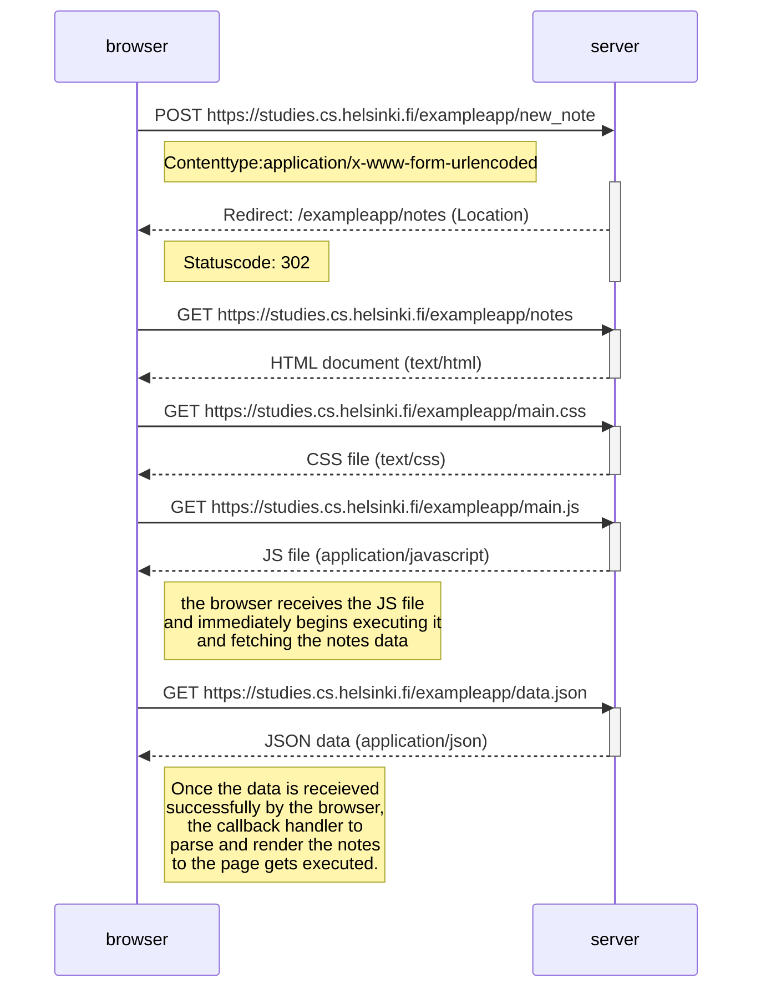

```mermaid
sequenceDiagram
    participant browser
    participant server

    browser->>server: POST https://studies.cs.helsinki.fi/exampleapp/new_note

    Note right of browser: Contenttype:application/x-www-form-urlencoded

    activate server
    server-->>browser: Redirect: /exampleapp/notes (Location)

    Note right of browser: Statuscode: 302
    deactivate server

    browser->>server: GET https://studies.cs.helsinki.fi/exampleapp/notes

    activate server
    server-->>browser: HTML document (text/html)
    deactivate server

    browser->>server: GET https://studies.cs.helsinki.fi/exampleapp/main.css

    activate server
    server-->>browser: CSS file (text/css)
    deactivate server

    browser->>server: GET https://studies.cs.helsinki.fi/exampleapp/main.js

    activate server
    server-->>browser: JS file (application/javascript)
    deactivate server

    Note right of browser: the browser receives the JS file<br> and immediately begins executing it<br> and fetching the notes data

    browser->>server: GET https://studies.cs.helsinki.fi/exampleapp/data.json

    activate server
    server-->>browser: JSON data (application/json)
    deactivate server

    Note right of browser: Once the data is receieved <br>successfully by the browser,<br> the callback handler to<br> parse and render the notes<br> to the page gets executed.
```
