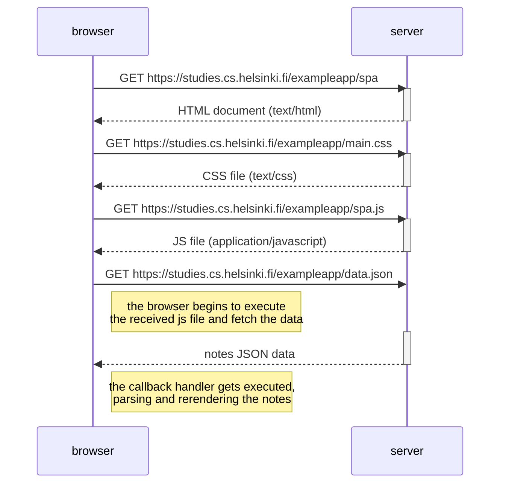

```mermaid
sequenceDiagram
participant browser
participant server

browser->>server: GET https://studies.cs.helsinki.fi/exampleapp/spa
activate server
server-->>browser: HTML document (text/html)
deactivate server

browser->>server: GET https://studies.cs.helsinki.fi/exampleapp/main.css
activate server
server-->>browser: CSS file (text/css)
deactivate server

browser->>server: GET https://studies.cs.helsinki.fi/exampleapp/spa.js
activate server
server-->>browser: JS file (application/javascript)
deactivate server

browser->>server: GET https://studies.cs.helsinki.fi/exampleapp/data.json
Note right of browser: the browser begins to execute<br> the received js file and fetch the data
activate server
server-->>browser: notes JSON data
deactivate server
Note right of browser: the callback handler gets executed,<br> parsing and rerendering the notes
```
