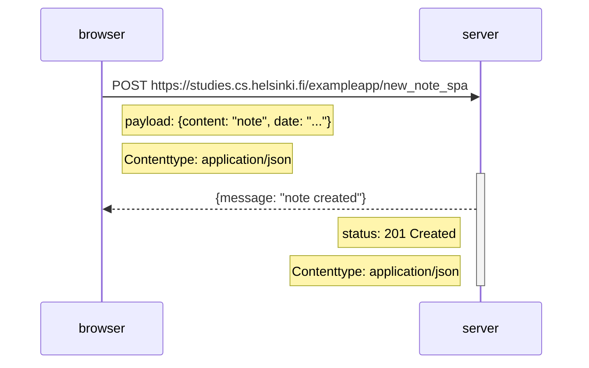

```mermaid
sequenceDiagram
    participant browser
    participant server

    browser->>server: POST https://studies.cs.helsinki.fi/exampleapp/new_note_spa
    note right of browser: payload: {content: "note", date: "..."}
    note right of browser: Contenttype: application/json
    activate server
    server-->>browser: {message: "note created"}
    note left of server: status: 201 Created
    note left of server: Contenttype: application/json
    deactivate server
```
